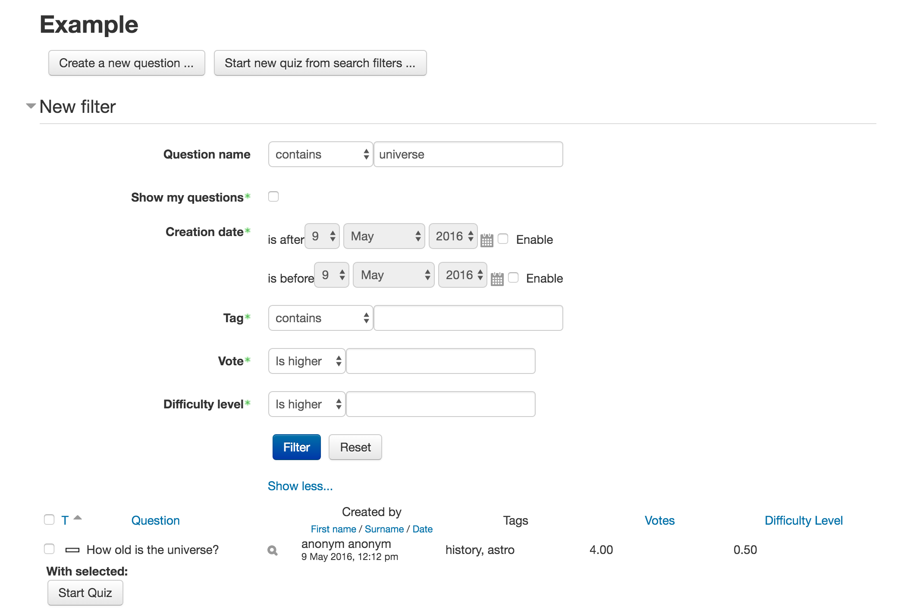
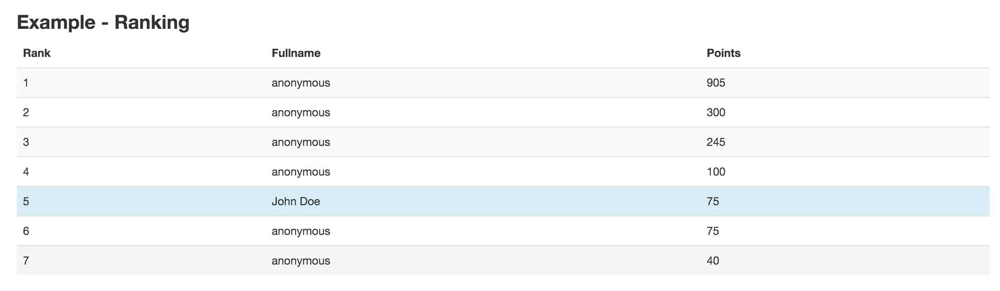
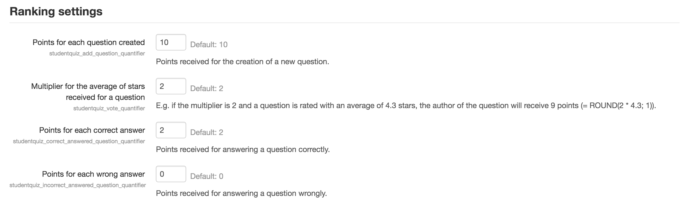

# moodle-mod_studentquiz

The studentquiz activity is an activity for students to add and share questions.
Students can add questions to the studentquiz and see only those questions. They have the 
opportunity to add questions, search or filter them and start a quiz from the questions
to practice.

### Creating a new studentquiz

In the create activity screen there are two specific options:

#### Anonymize creator and ranking for students

The anonymize option hides the creator information in the table (ranking and question) for students. If it is active the students can only filter their own 
questions but not others.

#### Quiz Practice Settings

In this setting you can choose which question behaviour is active for the students practice quizzes.

### Overview

The activity entrypoint and main view show all questions of the activity. The view is similar to the question bank overview.
Everyone who has access to the course can add questions and see questions of other students of the course. The teacher or admin 
has the option to anonymize the table.

The question table has common sort and filter functionality. Users can filter by question, creator (if is not anonymized), tags, votes, or by difficulty level.

The user has the option to select questions or start a question from all filtered question and start a quiz to practice those.  

### Question

In this quiz activity all questions from the question bank are supported. Teachers or Admins
can import/export questions.

### Quiz

Studentquiz using the quiz activity engine.

### Report

Activity users can see all the quiz reports they have done.

The reporting offers a ranking.
The ranking gives points to students who add and answer questions. Furthermore, the creator an upvoted question gets points as well. The idea is 
to motivate students. The ranking table can be anonymized too with the anonymize option. 

#### Ranking Settings 

Ranking settings is in the plugin settings and only an admin can change it. The raking settings allow to configurate the points multiplier.

## Studentquiz question behaviour plugin

For the best work and for the ranking use [Studentquiz Question Behaviour](https://github.com/frankkoch/moodle-qbehaviour_studentquiz).
This plugin adds the ability to vote for questions.

## Installation

The studentquiz activity depends on the quiz activity. (installed by default)

Download the zip file from github. Unzip the downloaded file *moodle-mod_studentquiz-master.zip*,
rename it to *studentquiz* and move it to your *moodle_installation_path/mod/*. Login as 
an Admin and follow installation instructions. 

An other way to install the studentquiz behaviour is by going to the *Site administration -> Plugins -> Install plugins* page. 
Note that the folder name and the zip have to be named *studentquiz*.

## License

[GNU GPL v3 or later](http://www.gnu.org/copyleft/gpl.html) 

## Moodle Version

Supported is Moodle v3. Not tested with Moodle v2.

## Copyright

[Hochschule für Technik Rapperswil](https://www.hsr.ch/)