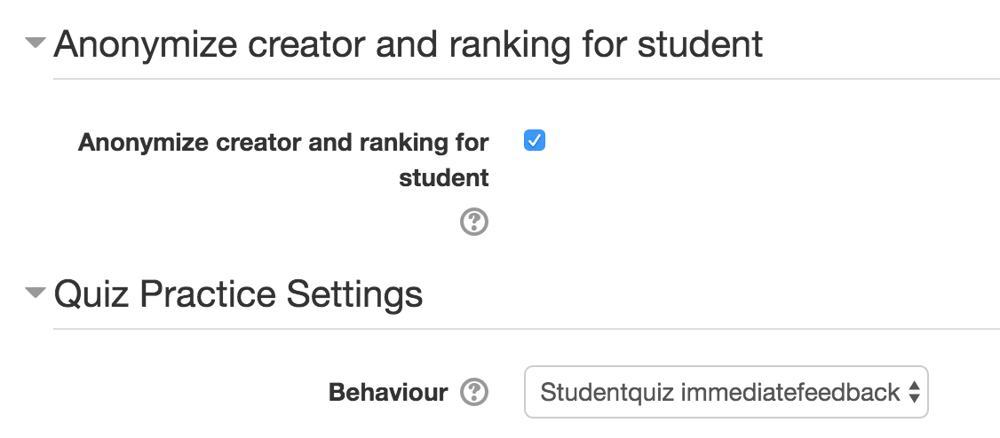

# moodle-mod_studentquiz

The studentquiz activity is an activity for students to add and share good questions.
Students can add question to the studentquiz and see only those questions. They have the 
opportunity to add questions, search or filter them and start a quiz from the questions
to practice.

### Create new studentquiz

In the create activity screen it has two specific options:

#### Anonymize creator and ranking for students

This is the option to anonymize table and ranking for students. If is active the students can only filter his own 
questions but not others.

#### Quiz Practice Settings

In this setting you can choice which question behaviour have for the students practice quizzes.

### Overview

The activity entrypoint and main view shows all questions of the activity. The view is similar to the question bank overview.
Everyone who has access to the course can add questions and see questions of other students of the course. The teacher or admin 
has the option to anonymize the table.

The question table has the common sort and filter functionality. User can filter by question, creator (if is not anonymized), tags, votes, difficulty level.

The user has the option to select questions or start a question from all filtered question and start a quiz to practice those.  

### Question

Questions are used from question bank and are all supported where are supported in the quiz activity.

### Quiz

Studentquiz using the quiz activity engine.

### Report

Activity users can see all the quiz reports they have done.

The reporting offers a ranking.
The ranking awars points to students add questions, votes and answering questions. The idea is 
to spur students. The ranking table can anonymized too with the anonymize option. 

## Studentquiz question behaviour plugin

For the best work and for the ranking use [Studentquiz Question Behaviour](https://github.com/frankkoch/moodle-qbehaviour_studentquiz).
This plugin gives the funktionality to vote for questions.

## Installation

The studentquiz activity have a dependency to the quiz activity. (default installed)

Download the zip file from github. Unzip the downloaded file *moodle-mod_studentquiz-master.zip*
rename it to *studentquiz* and move it to your *moodle_installation_path/mod/behaviour/*. Login as 
an Admin and follow installation instructions. 

Or install the studentquiz behaviour over the *Site administration -> Plugins -> Install plugins*. 
Note that the foldername and the zip have to be named *studentquiz*.

## Licence
[GNU GPL v3 or later](http://www.gnu.org/copyleft/gpl.html) 

## Moodle Version
Is implemented for Moodle v3. Not tested with Moodle v2.