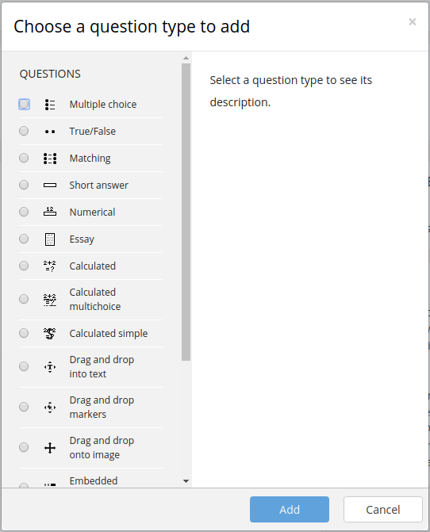

Contribute
==========

As a student you can contribute in various ways to the question pool of 
the StudentQuiz Activity in your course. 

#. Add a new question
#. Comment a question of someone else
#. Rate a question of somesone else.

Adding a question
-----------------

To create a question, use the “Create new question” button. You can select from a variety of questions types, depending on
what your teacher has configured:

Commenting a question
---------------------

If you practice on a question and the question is checked, it shows the answer and any feedback.

You can discuss the solution or the question in the comments. They won't be shown to someone who
hasen't answered the question yet.

Your teacher can decide, whether your name will is displayed or anonymized
as the author of the comment.

For more information about your score and ranking see _score.

Rating a question
-----------------

If you practice on a question and the question is checked, it shows the answer and any feedback.

You will be asked to rate each question you answered for it's usefulness and
suitability for you. Your teacher might have given you some guidance on 
what is considered to be a good question, but in the end it is you and your
fellow students enrolled in the class that define the rating of the 
questions within StudentQuiz. 

.. _score: