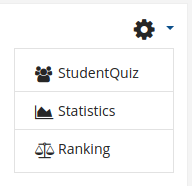
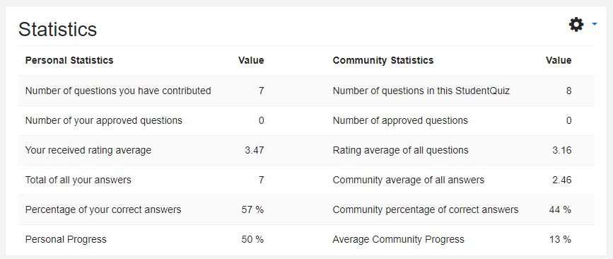
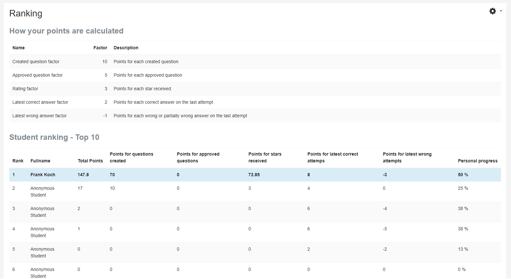

.. _student_score:

Score
=====

The StudentQuiz provides students with two different reports which can be viewed in the navigation:

Statistics
----------

The statistics report gives you an overview of your progress and your community progress within the StudentQuiz Activity:

Ranking
-------

The rank table is used to motivate students to challenge each other.

