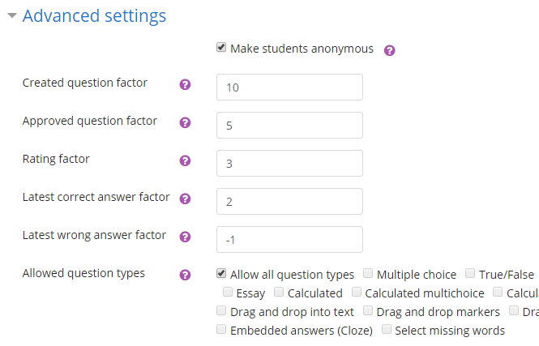

=========
Configure
=========

-----------------------------
Create a StudentQuiz Activity
-----------------------------

Creating a StudentQuiz activity has no difference to other activities. Go to your course
and press on the “Turn editing on” button. Choose your topic where you want the
new Student-Quiz activity and press “+ Add an activity or resource” on the right side.

.. image:: ../_images/add_activity.png
	:align: center

Choose StudentQuiz and press “Add”. Give a name to the new activity. The Advanced settings is important. You have some options that you can configure

--------------------------------
Configure a StudentQuiz Activity
--------------------------------

Make students anonymous
=======================

This will prevent students from seeing the names of the question’s author. However, students will still see their own names on questions they created themselves. Teachers will always see the creator’s names.

Created question factor
=======================

Points for each created question

Approved question factor
========================

Points for each approved question

Rating factor
=============

Points for each star received

Latest correct answer factor
============================

Points for each correct answer on the last attempt

Latest wrong answer factor
==========================

Points for each wrong or partially wrong answer on the last attempt

Allowed question types
======================

Here you can specify which types of questions are allowed

-------------------------------
Removing a StudentQuiz Activity
-------------------------------

Removing a StudentQuiz Activity can be done the same way as removing any other Moodle Activities. Go to your course and click on the “Turn editing on” button. Choose the StudentQuiz Activity you want to remove and press “Edit -> Delete”.