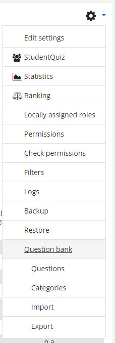

=====
Reuse
=====

-------------
Question bank
-------------

As a teacher, you get access to all question bank functions using the question bank in the StudentQuiz activity.

Its main purpose is to get overview of all questions, for importing or exporting whole sets of questions and possibly to move around questions between categories. This view should not be used to edit questions, as it won’t notify students of the applied changes.

StudentQuiz loads all questions from its question category and its subcategories.
Thus you can also move questions into subcategories of the StudentQuiz question category to organise the questions to your liking.

**Important**
    Use the question bank in the StudentQuiz activity, otherwise you won't be in the context of StudentQuiz and you can't see its question categories.
